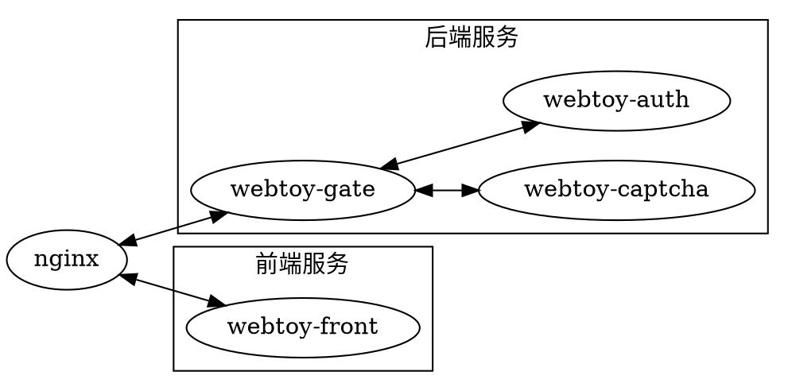

- [Web Toy](#web-toy)
  - [编译并运行](#编译并运行)
  - [规划](#规划)
    - [服务](#服务)
    - [等级](#等级)

# Web Toy
一个简单的前后端分离的web玩具项目

## 编译并运行
确保docker和docker-compose正确安装, 运行本项目根目录中的`run.sh`即可

## 规划

### 服务

* 后端
  * webtoy-gate: 后端服务网关
  * webtoy-captcha: 验证码服务
  * webtoy-auth: 认证服务, 也充当用户查询的用途
* 前端
  * webtoy-front: 前端服务

### 等级
所有页面分为三个等级, 分别为
* public: 无需登录即可访问
* private: 需要登录之后才可访问
* admin: 只有管理员可以访问